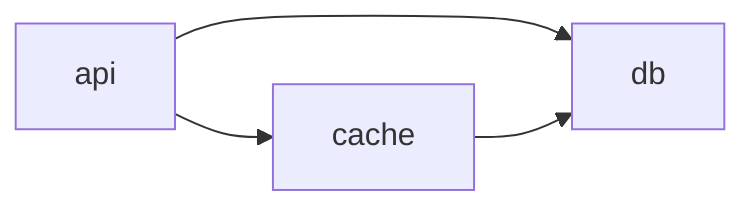
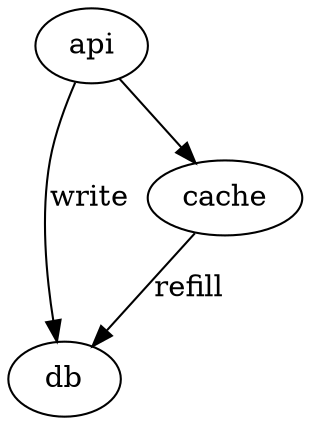

# Diagram-as-Code Tools

Reference layer. This skill explains *what tools exist and how to invoke them*. Project-specific direction (where to write source files, what frontmatter to attach, when to pick which tool for *this* project's content) lives in the project, not here.

## Quick decision

- **Inline-rendered docs** (GitHub README, Obsidian, Notion): **Mermaid**. Render happens at view time; no build step.
- **Pre-rendered architecture / system diagrams** (committed SVG): **D2**. Better defaults, single Go binary, no browser dependency.
- **Graph-shaped data with layout-algorithm choice** (call graphs, dependency graphs, state machines): **Graphviz/DOT**. Old, rigid, well-trained — low LLM error rate.
- **C4 model with multiple consistent views** (system context + container + component from one model): **Structurizr DSL**. Exports to Mermaid/D2/PlantUML/DOT.
- **Legacy diagrams or PlantUML-only ecosystems**: **PlantUML** via Kroki. Skip as primary; flexible syntax + Java dep.

## LLM-authoring caveat

Flexible syntaxes (Mermaid, PlantUML) produce more first-try invalid output than rigid ones (D2, DOT). When you author a diagram source as an agent: validate before render. Render failure inside the tight loop is cheap; render failure after you've moved on is expensive. Lint, then render.

## D2

Indentation-based, unified syntax across diagram types. Single Go binary, no browser.

```d2
api -> db: write
api -> cache: read
cache -> db: refill
```

- `d2 input.d2 output.svg` — render to SVG (default)
- `d2 input.d2 output.png` — render to PNG (requires `--bundle=false` for headless)
- `d2 --layout=elk input.d2 output.svg` — ELK layout (better for hierarchical with ports)
- `d2 fmt input.d2` — format
- `d2 --watch input.d2 output.svg` — live-reload during authoring

Layout engines: `dagre` (default), `elk` (bundled), `tala` (commercial, requires separate install).

## Mermaid

Render via the host renderer (GitHub, Obsidian) — no local install required when target is inline. For pre-rendered SVG/PNG, prefer Kroki over installing `@mermaid-js/mermaid-cli` (mmdc), which pulls Chromium.

Common diagram types: `flowchart`, `sequenceDiagram`, `classDiagram`, `erDiagram`, `stateDiagram-v2`, `gantt`, `gitGraph`, `mindmap`, `C4Context`.



Watch out: `:` vs `=` in different diagram types, invented shape names silently fall back to defaults, ID reuse across diagrams has subtly different semantics.

## Graphviz / DOT

Rigid, old, well-trained. Hand-authoring is verbose; agents handle it well.



- `dot -Tsvg input.dot -o output.svg`
- `neato -Tsvg input.dot -o output.svg` — spring-model for undirected
- `fdp`, `sfdp`, `circo`, `twopi` — alternative layouts

Pick `dot` for hierarchical, `neato`/`fdp` for undirected, `circo` for circular, `twopi` for radial.

## Structurizr DSL

Model-first. One workspace defines people, software systems, containers, components, deployment nodes; multiple views derive from the model.

```structurizr
workspace {
  model {
    user = person "User"
    system = softwareSystem "App" {
      api = container "API"
      db = container "Database"
    }
    user -> api "Uses"
    api -> db "Reads/writes"
  }
  views {
    systemContext system "context" {
      include *
      autolayout
    }
    container system "container" {
      include *
      autolayout
    }
    theme default
  }
}
```

`structurizr-cli` is installed locally — use it. Validates and exports without Kroki's swallowed-error problem. (It exports to other DSL formats; rendering to SVG/PNG happens via the native tool of whichever format you exported to.)

- `structurizr-cli validate -workspace system.dsl` — parse + semantic check, prints precise errors
- `structurizr-cli export -workspace system.dsl -format plantuml -output out/` — emit one .puml per view
- `structurizr-cli export -workspace system.dsl -format mermaid -output out/`
- `structurizr-cli export -workspace system.dsl -format d2 -output out/`
- `structurizr-cli export -workspace system.dsl -format dot -output out/`

The export is composable: render the .puml/.mmd/.d2/.dot files with their native tools (or Kroki) to get SVG/PNG. Structurizr CLI itself doesn't render to image — it's a model authoring + export tool.

**DSL gotchas (autonomous-author footguns):**

- Relationships use bare variable names, not dotted paths. `kitty -> ksesh "stdio"` is correct; `system.kitty -> system.ksesh` fails with "destination element does not exist".
- Software-system tags use positional 4th arg, not a `tags "..."` block. `softwareSystem "Telegram" "desc" "External"` is correct.
- Each view needs both a key (positional after the scope) and a body. `systemContext system "context" { include * autolayout }` is correct; bare `systemContext system` fails when emitted via Kroki.
- `theme default` lives at the end of the views block, after `styles` if you have one.

When in doubt, validate first: `structurizr-cli validate -workspace input.dsl`.

## Kroki (HTTP rendering gateway)

When local CLIs aren't installed, or to avoid the Chromium/Java dependency surface: POST source to a Kroki instance, receive rendered SVG/PNG/PDF.

API shape:

```sh
curl ${KROKI_URL:-https://kroki.io}/d2/svg \
  -H "Content-Type: text/plain" \
  --data-binary @input.d2 \
  -o output.svg
```

**Critical**: pass `Content-Type: text/plain` (or `application/json` for JSON-shaped diagrams). Without it, curl defaults to `application/x-www-form-urlencoded` and Kroki tries to form-decode the body, tripping `TooLongFormFieldException` even on small inputs.

For Structurizr DSL with multiple views, the view to render goes in a header:

```sh
curl ${KROKI_URL:-https://kroki.io}/structurizr/svg \
  -H "Content-Type: text/plain" \
  -H "Kroki-Diagram-Options: view-key=<view-key>" \
  --data-binary @system.dsl \
  -o output.svg
```

Or with explicit type/format:

```sh
curl ${KROKI_URL:-https://kroki.io}/<type>/<format> \
  -H "Content-Type: text/plain" \
  --data-binary @input.<ext> \
  -o output.<ext>
```

Supported types include: `mermaid`, `d2`, `graphviz`, `plantuml`, `c4plantuml`, `structurizr`, `excalidraw`, `bpmn`, `wavedrom`, `vega`, `vegalite`, `nomnoml`, `pikchr`, `svgbob`, `bytefield`, `ditaa`, `erd`, `seqdiag`, `actdiag`, `blockdiag`, `nwdiag`, `packetdiag`, `rackdiag`, `wireviz`.

Output formats: `svg`, `png`, `pdf`, `jpeg` (subset depending on type).

`KROKI_URL` defaults to `https://kroki.io` (public demo, non-commercial use, swallows error messages above a size threshold). For self-hosted, use the `services/kroki/compose.yaml` in kspace: `just kroki-up` brings up core + Mermaid companion at `http://localhost:8000`. Other repos can copy or reference that compose file.

Mermaid, BPMN, Excalidraw, and diagrams.net live in optional companion containers (`yuzutech/kroki-mermaid`, etc.) — not bundled in the base image.

## Validation patterns

When generating diagram source as an agent:

1. **Write source to a tempfile or page-adjacent path before render.**
2. **Render with `--validate` or run a dry render first.** D2: `d2 fmt input.d2` catches syntax. Graphviz: `dot -Tcanon input.dot >/dev/null` parses without rendering.
3. **On render failure**, the error message names a line and column. Patch the source and retry inside the same loop — don't move on.
4. **Prefer rigid DSLs (D2, DOT) for agent-authored content** unless the diagram needs to render inline somewhere that only speaks Mermaid.

## Available locally

Binaries installed by this module: `d2`, `dot` (and the rest of Graphviz: `neato`, `fdp`, `sfdp`, `circo`, `twopi`), `structurizr-cli` (validate + multi-format export; needs the bundled JRE).

`mmdc` and PlantUML are intentionally not installed locally — use Kroki for these to avoid the Chromium / standalone Java surface. Structurizr CLI is included because its swallow-no-error behavior on Kroki makes local validation worth the JRE.

If a project genuinely needs local rendering for Mermaid (offline, sensitive content), install `mmdc` on demand: `npx -y @mermaid-js/mermaid-cli`.
